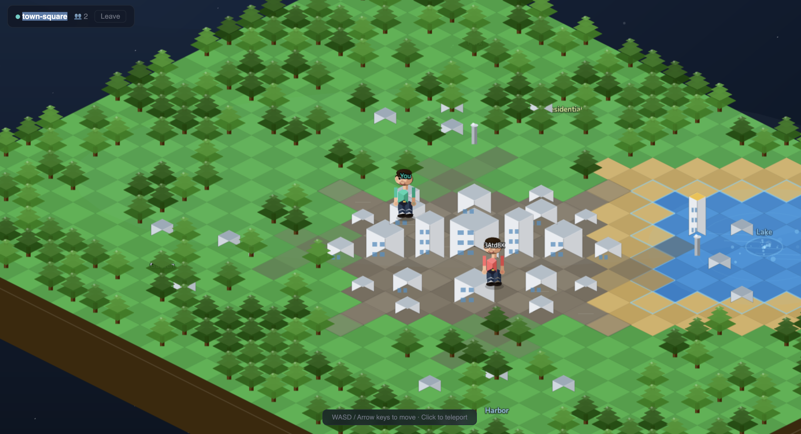
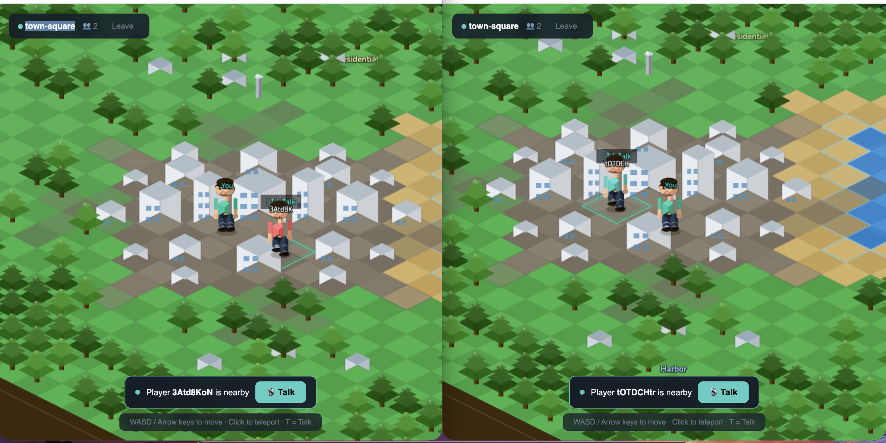
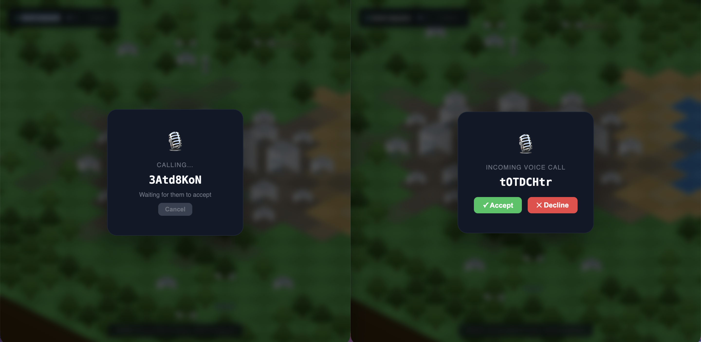

<div align="center">

# 🌍 Metaverse-T

### A Real-Time Multiplayer Metaverse Experience

*Explore a beautiful low-poly island world, meet people, and communicate in real-time with voice chat*

[](https://www.typescriptlang.org/)
[](https://reactjs.org/)
[](https://phaser.io/)
[](https://socket.io/)
[](https://webrtc.org/)

---

### 🖼️ Screenshots

<div align="center">


*The beautiful low-poly floating island with multiple zones*

<table>
  <tr>
    <td></td>
    <td></td>
  </tr>
  <tr>
    <td align="center"><em>Real-time multiplayer interaction</em></td>
    <td align="center"><em>City district with white buildings</em></td>
  </tr>
</table>

<table>
  <tr>
    <td></td>
    <td></td>
  </tr>
  <tr>
    <td align="center"><em>Sparkling lake with water animations</em></td>
    <td align="center"><em>Realistic human character with animations</em></td>
  </tr>
</table>

</div>

</div>

## ✨ Features

### 🎮 **Immersive 2D Isometric World**
- Beautiful low-poly floating island design with dynamic day/night atmosphere
- Realistic terrain zones: grass plains, sandy beaches, sparkling lake, and city districts
- Hundreds of procedurally placed trees creating lush forests
- White low-poly buildings forming a vibrant city center
- Ambient animations: water ripples, particle effects, and atmospheric lighting

### 👥 **Real-Time Multiplayer**
- See other players move in real-time across the island
- Smooth character animations with realistic walking cycles
- Proximity-based player detection system
- Unique player identification with color-coded avatars

### 🎙️ **Voice Communication**
Built-in voice chat system powered by WebRTC for seamless communication:

<div align="center">
<table>
  <tr>
    <td></td>
    <td></td>
  </tr>
  <tr>
    <td align="center"><em>Initiate voice calls to nearby players</em></td>
    <td align="center"><em>Accept or decline incoming voice calls</em></td>
  </tr>
</table>
</div>

- **Proximity-based calling** - Talk to players near you
- **Crystal-clear audio** - WebRTC peer-to-peer connections
- **Elegant UI** - Beautiful call overlays with Accept/Decline options
- **Real-time status** - See who's available to talk

### 🎨 **Realistic Characters**
- Human-like avatars with detailed features:
  - Expressive faces with eyes, eyebrows, nose, and mouth
  - Realistic skin tones and hair styles
  - Dynamic clothing colors for personalization
  - Separate arm and leg animations for natural movement
- Frame-rate independent animations (smooth on all devices)

### 🌐 **Cross-Platform Support**
- Responsive design works on desktop and mobile browsers
- Touch controls for mobile devices
- Optimized rendering for various screen sizes
- Consistent performance across different frame rates

---

## 🛠️ Tech Stack

### **Frontend**
- **Phaser 3** - 2D game engine for isometric world rendering
- **React** - UI components and state management
- **TypeScript** - Type-safe development
- **Vite** - Lightning-fast build tool and dev server

### **Backend**
- **Node.js** - Server runtime
- **Express** - Web server framework
- **Socket.IO** - Real-time bidirectional event-based communication
- **WebRTC** - Peer-to-peer voice communication

### **Development Tools**
- **TypeScript** - Shared types between client and server
- **pnpm** - Fast, disk-space efficient package manager
- **ESLint** - Code quality and consistency

---

## 🚀 Getting Started

### Prerequisites

- **Node.js** (v18 or higher)
- **pnpm** (recommended) or npm

### Installation

1. **Clone the repository**
   ```bash
   git clone https://github.com/srujandivakar/Metaverse-T.git
   cd Metaverse-T
   ```

2. **Install dependencies**
   ```bash
   pnpm install
   ```

3. **Set up environment variables**
   
   Create `.env` files in both client and server directories:
   
   **Client** (`client/.env`):
   ```env
   VITE_SERVER_URL=https://localhost:3000
   ```
   
   **Server** (`server/.env`):
   ```env
   PORT=3000
   NODE_ENV=development
   ```

4. **Generate SSL certificates** (for HTTPS/WebRTC)
   ```bash
   # Generate self-signed certificates for local development
   openssl req -x509 -newkey rsa:4096 -keyout cert-key.pem -out cert.pem -days 365 -nodes
   ```

5. **Start the development servers**
   ```bash
   # Start both client and server concurrently
   pnpm dev
   ```

6. **Open the application**
   - Navigate to `https://localhost:5173` in your browser
   - Accept the self-signed certificate warning (for local development)

---

## 🎮 How to Play

### **Movement**
- **Keyboard**: Use `WASD` or arrow keys to move your character
- **Mouse**: Click anywhere on the island to walk there
- **Mobile**: Tap on the screen to move

### **Interaction**
1. Walk near other players to see the **proximity indicator**
2. Press `T` or click the "Talk" button to initiate a voice call
3. Accept incoming calls to start chatting
4. Move away to end the proximity connection

### **Exploring**
- Visit the **Town Square** - The bustling city center
- Relax by the **Lake** - Enjoy the water animations
- Explore the **Park** - Dense forests with swaying trees
- Discover the **Harbor** - Near the island edges

---

## 📁 Project Structure

```
mping/
├── client/              # Frontend React + Phaser application
│   ├── src/
│   │   ├── game/       # Phaser game scenes
│   │   │   ├── WorldScene.ts    # Main isometric world
│   │   │   └── PhaserGame.tsx   # Phaser wrapper component
│   │   ├── voice/      # WebRTC voice chat logic
│   │   ├── components/ # React UI components
│   │   └── socket.ts   # Socket.IO client
│   └── public/         # Static assets
│
├── server/             # Backend Node.js server
│   └── src/
│       └── index.ts    # Express + Socket.IO server
│
└── shared/             # Shared TypeScript types
    └── src/
        └── index.ts    # Event definitions and interfaces
```

---

## 🎨 World Design

The island features a carefully crafted low-poly aesthetic inspired by modern 3D games:

- **Floating Island**: Visible brown earth sides with grass on top
- **Terrain Layers**:
  - 🌊 **Water** - Blue lake with shimmer effects
  - 🏖️ **Beach** - Sandy ring around the water
  - 🏙️ **City** - Grey roads with white buildings
  - 🌲 **Grass** - Green plains with procedural tree coverage
- **Dynamic Effects**:
  - Water ripples and sparkles
  - Particle emitters (lake splash, wind-blown leaves)
  - Subtle ambient lighting
  - Animated building windows

---

## 🤝 Contributing

Contributions are welcome! Please feel free to submit a Pull Request.

1. Fork the repository
2. Create your feature branch (`git checkout -b feature/AmazingFeature`)
3. Commit your changes (`git commit -m 'Add some AmazingFeature'`)
4. Push to the branch (`git push origin feature/AmazingFeature`)
5. Open a Pull Request

---

## 📝 License

This project is licensed under the MIT License - see the [LICENSE](LICENSE) file for details.

---

## 🙏 Acknowledgments

- **Phaser** - For the amazing 2D game engine
- **Socket.IO** - For real-time communication infrastructure
- **WebRTC** - For enabling peer-to-peer voice connections
- The open-source community for inspiration and support

---

<div align="center">

### Made with ❤️ by [Srujan Divakar](https://github.com/srujandivakar)

If you found this project interesting, please consider giving it a ⭐!

</div>
